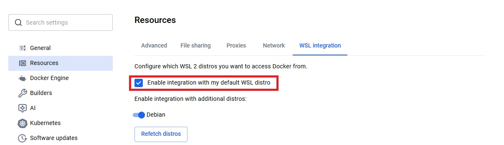

# 🐧 Debian on WSL – Complete Development Setup

This guide walks you through setting up a powerful development environment inside **WSL Debian** (Windows Subsystem for Linux). It includes:

- **Oh My Posh** – beautiful prompt theme
- **Tree-sitter CLI**, **Ripgrep**, **GCC**, **Make**, **Bunjs,Nodejs**, **PHP**, **Python**
- Bash aliases similar to your PowerShell setup

---

## 📋 Prerequisites

- WSL installed on Windows (`wsl --install` in an admin PowerShell)
- A running Debian distribution (install from Microsoft Store or via `wsl --install -d Debian`)
- A **Nerd Font** installed on Windows (e.g., `Cascadia Code NF`, `FiraCode Nerd Font`) – required for Oh My Posh and Neovim icons.

---

## 🚀 Step-by-Step Installation

Open your WSL Debian terminal and run the commands in each step.

### 1. System Update & Essential Tools

```bash
sudo apt update && sudo apt upgrade -y
sudo apt install -y curl git unzip
```

### 2. Install GCC, Make, Ripgrep

```bash
sudo apt install -y gcc make ripgrep
```

Verify:
```bash
gcc --version
make --version
rg --version
```

### 3. Install Tree-sitter CLI

The `tree-sitter` package is not available in default Debian repos. Use one of these methods:

#### Using npm (Node.js, Bun.js)

```bash
sudo apt install -y nodejs npm
curl -fsSL https://bun.sh/install | bash
bun install -g tree-sitter-cli
```

### 4. Install Oh My Posh

```bash
# Download and install Oh My Posh
curl -s https://ohmyposh.dev/install.sh | bash

# Add to PATH (the script may already do this)
echo 'export PATH="$PATH:$HOME/.local/bin"' >> ~/.bashrc

# Activate Oh My Posh in bash
echo 'eval "$(oh-my-posh init bash --config /mnt/c/Users/<Username>/.posh-themes/hunta.omp.json)"' >> ~/.bashrc
```

Reload your shell or run `source ~/.bashrc`. The prompt should change immediately.

### 5. Add PowerShell-style Aliases

Edit your bash configuration file:
```bash
nano ~/.bashrc
```

Add these lines at the end of the file:

```bash
# Aliases inspired by PowerShell profile
alias ..='cd ..'
alias ...='cd ../..'
alias -- -='cd -'
alias desktop='cd /mnt/c/Users/$USER/Desktop'
alias dev='cd /mnt/d/Projects'               # adjust drive letter if needed

alias g='git'
alias ll='ls -alF'
alias la='ls -A'
alias l='ls -CF'

# PATH display
alias path='echo $PATH | tr ":" "\n"'

# Week number
alias week='date +%V'

# Enable color output for ls (Linux style)
if [ -x /usr/bin/dircolors ]; then
    test -r ~/.dircolors && eval "$(dircolors -b ~/.dircolors)" || eval "$(dircolors -b)"
    alias ls='ls --color=auto'
    alias grep='grep --color=auto'
fi
```

Save (`Ctrl+O`, `Enter`) and exit (`Ctrl+X`). Then reload:
```bash
source ~/.bashrc
```

Test your aliases:
```bash
..
...
-
desktop
dev
g --version
web   # should open Microsoft Edge on Windows
week
```

### 6. Install PHP

```bash
# Install PHP with common extensions
sudo apt install -y php php-cli php-common php-curl php-mbstring php-xml php-zip

# install Composer
cd /tmp/
php -r "copy('https://getcomposer.org/installer', 'composer-setup.php');"
php -r "if (hash_file('sha384', 'composer-setup.php') === 'c8b085408188070d5f52bcfe4ecfbee5f727afa458b2573b8eaaf77b3419b0bf2768dc67c86944da1544f06fa544fd47') { echo 'Installer verified'.PHP_EOL; } else { echo 'Installer corrupt'.PHP_EOL; unlink('composer-setup.php'); exit(1); }"
php composer-setup.php
php -r "unlink('composer-setup.php');"
sudo mv composer.phar /usr/local/bin/composer
```

Verify:
```bash
php --version
composer --version
```

### 7. Install Python

```bash
# Install Python 3 and pip
sudo apt install -y python3 python3-pip

# Optionally make 'python' and 'pip' point to python3/pip3
echo 'alias python=python3' >> ~/.bashrc
echo 'alias pip=pip3' >> ~/.bashrc
source ~/.bashrc
```

Verify:
```bash
python3 --version
pip3 --version
```

---

## 🧪 Verification Checklist

After completing all steps, open a new WSL terminal and verify:

| Component | Command | Expected result |
|-----------|---------|------------------|
| Oh My Posh | `oh-my-posh --version` | version number |
| Tree-sitter CLI | `tree-sitter --version` | version number |
| Ripgrep | `rg --version` | version number |
| GCC | `gcc --version` | version number |
| Make | `make --version` | version number |
| PHP | `php --version` | PHP version info |
| Python | `python3 --version` | Python 3.x version |

---

## 🔧 Troubleshooting

### ❌ `tree-sitter: command not found`
- Reinstall using one of the three methods above. Ensure `~/.cargo/bin` is in your PATH (add `export PATH="$HOME/.cargo/bin:$PATH"` to `~/.bashrc`).

### ❌ Oh My Posh icons look like squares
- You need a Nerd Font installed on **Windows**. Set your terminal’s font (Windows Terminal, VS Code terminal, etc.) to a Nerd Font like `CaskaydiaCove Nerd Font` or `FiraCode Nerd Font`.

### ❌ `wget: command not found`
- Install wget: `sudo apt install -y wget`

### ❌ Permission denied when moving binaries
- Use `sudo` before commands that write to system directories.

### ❌ Aliases like `desktop` or `dev` don’t work
- Check that the paths exist in Windows. For `dev`, adjust `D:\Projects` to your actual project folder. Use lowercase drive letters in WSL (`/mnt/d/Projects`).

### ❌ WSL Integration not working (Docker Desktop, VS Code, etc.)
- Ensure the necessary integration settings are enabled for your distribution:
  - **Docker Desktop**: Go to *Settings* → *Resources* → *WSL Integration*, then enable integration for your Debian instance and apply/restart.
  - **VS Code**: Install the *Remote - WSL* extension and use “Open Folder in WSL” or run `code .` from inside WSL.
- The screenshot below shows a typical WSL integration configuration dialog.
  
  

- If Docker commands still fail, restart Docker Desktop or run `wsl --shutdown` and restart WSL.

---

## 📦 Optional: Install Additional Tools

If you need more development tools, consider:

```bash
# install php modules
sudo apt install php-mysql php-curl php-mbstring php-xml php-zip php-gd php-intl php-opcache php-xdebug
sudo phpenmod mysqli curl mbstring xml zip gd intl opcache

# Installing uv
wget -qO- https://astral.sh/uv/install.sh | sh
```

---

## 🎉 Done!

Your WSL Debian is now fully configured as a development environment with a beautiful prompt, and all the CLI tools you need. Happy coding!